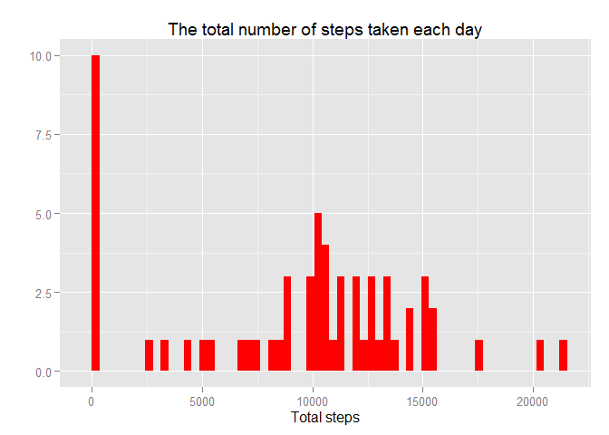
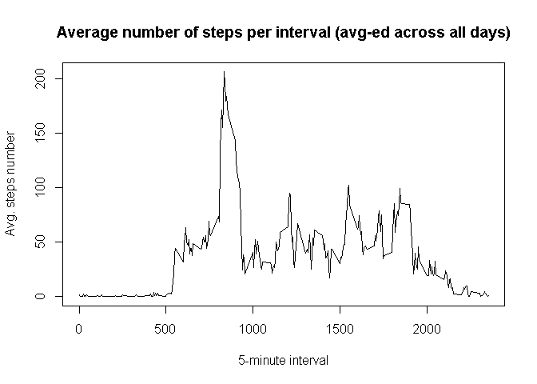

# Reproducible Research: Peer Assessment 1


```r
# Trying to load dependencies
library(data.table)
library(ggplot2)
```

## Loading and preprocessing the data


```r
# Load activities
activities.data.table <- fread("activity.csv")
# Convert dates to POSIX format
activities.data.table[, date := as.POSIXct(strptime(date, format = "%Y-%m-%d"))]
```

```
##        steps       date interval
##     1:    NA 2012-10-01        0
##     2:    NA 2012-10-01        5
##     3:    NA 2012-10-01       10
##     4:    NA 2012-10-01       15
##     5:    NA 2012-10-01       20
##    ---                          
## 17564:    NA 2012-11-30     2335
## 17565:    NA 2012-11-30     2340
## 17566:    NA 2012-11-30     2345
## 17567:    NA 2012-11-30     2350
## 17568:    NA 2012-11-30     2355
```

## What is mean total number of steps taken per day?

Histogram of the total number of steps taken each day:


```r
total.steps.per.day <- activities.data.table[, sum(steps, na.rm = TRUE), by = date]
with(list(d = total.steps.per.day), {
    d[, total.steps := V1]; d[, V1 := NULL]
    plot(total.steps ~ date, data = d, type = "h",
         main = "The total number of steps taken each day",
         xlab = "Date", ylab = "Total steps", col = "red")
})
```

 

Mean of the total number of steps taken per day:


```r
# Vector of dates without measurements
empty.dates <- activities.data.table[, all(is.na(steps)), by = date][V1 == T][["date"]]
# Excluding empty dates
normal.total.steps.per.day <- total.steps.per.day[!(date %in% empty.dates)]
mean.total.steps.per.day <- mean(normal.total.steps.per.day[["total.steps"]])
print(mean.total.steps.per.day)
```

```
## [1] 10766.19
```

Median of the total number of steps taken per day:


```r
# Excluding empty dates
median.total.steps.per.day <- median(normal.total.steps.per.day[["total.steps"]])
print(median.total.steps.per.day)
```

```
## [1] 10765
```

## What is the average daily activity pattern?

The 5-minute interval (x-axis) and the average number of steps taken, averaged across all days (y-axis)


```r
avg.steps.number.per.interval <- activities.data.table[, mean(steps, na.rm = T), by = interval]
with(list(d = avg.steps.number.per.interval), {
    d[, total.steps := V1]
    plot(total.steps ~ interval, data = d, type = "l",
         main = "Average number of steps per interval (avg-ed across all days)",
         xlab = "5-minute interval", ylab = "Avg. steps number")
})
```

 


Interval, on average across all the days in the dataset, contains the maximum number of steps:


```r
with(list(d = avg.steps.number.per.interval), {
    max.interval.row <- d[which.max(d[["total.steps"]])]
    print(max.interval.row)
})
```

```
##    interval       V1 total.steps
## 1:      835 206.1698    206.1698
```

## Imputing missing values

Total number of missing values in the dataset:


```r
total.na.count <- sum(is.na(activities.data.table[["steps"]]))
sprintf("%.0f%%", total.na.count * 100 / nrow(activities.data.table))
```

```
## [1] "13%"
```

Total number of days with some missing values:


```r
sum(activities.data.table[, any(is.na(steps)), by = date][["V1"]])
```

```
## [1] 8
```

Total number of days without measurements at all:


```r
sum(activities.data.table[, all(is.na(steps)), by = date][["V1"]])
```

```
## [1] 8
```

The whole days are missing. That's why the *average number of steps per day* will be appropriate estimation for missing values:

*Before imputing:*


```r
summary(activities.data.table)
```

```
##      steps             date               interval     
##  Min.   :  0.00   Min.   :2012-10-01   Min.   :   0.0  
##  1st Qu.:  0.00   1st Qu.:2012-10-16   1st Qu.: 588.8  
##  Median :  0.00   Median :2012-10-31   Median :1177.5  
##  Mean   : 37.38   Mean   :2012-10-31   Mean   :1177.5  
##  3rd Qu.: 12.00   3rd Qu.:2012-11-15   3rd Qu.:1766.2  
##  Max.   :806.00   Max.   :2012-11-30   Max.   :2355.0  
##  NA's   :2304
```

*After imputing:*


```r
intervals.per.day <- activities.data.table[, .N, by = date][1][["N"]]
# Estimation
mean.total.steps.per.interval <- mean.total.steps.per.day / intervals.per.day

# Corrected/imputed activities
activities.imputed <- data.table(activities.data.table)
invisible({
    activities.imputed[, steps := as.numeric(steps)]
    activities.imputed[is.na(steps), steps := mean.total.steps.per.interval]
})
summary(activities.imputed)
```

```
##      steps             date               interval     
##  Min.   :  0.00   Min.   :2012-10-01   Min.   :   0.0  
##  1st Qu.:  0.00   1st Qu.:2012-10-16   1st Qu.: 588.8  
##  Median :  0.00   Median :2012-10-31   Median :1177.5  
##  Mean   : 37.38   Mean   :2012-10-31   Mean   :1177.5  
##  3rd Qu.: 37.38   3rd Qu.:2012-11-15   3rd Qu.:1766.2  
##  Max.   :806.00   Max.   :2012-11-30   Max.   :2355.0
```

*Imputed data histogram* of the total number of steps taken each day *compared* to actual data:


```r
total.steps.per.day.imputed <- activities.imputed[, sum(steps), by = date]
invisible({
    with(list(d = total.steps.per.day.imputed), {
        d[, total.steps := V1]
        d[, V1 := NULL]
        d[, imputed := T]
    })
    total.steps.per.day[, imputed := FALSE]
})
with(list(d = rbind(total.steps.per.day.imputed, total.steps.per.day)), {
    #g <- ggplot(d, aes(date, total.steps, color = imputed)) +
    #    geom_histogram(d[imputed == F], fill = "red", alpha = 0.3) +
    #    geom_histogram(d[imputed == T], fill = "green", alpha = 0.3)
    #print(g)
})
```

```
## NULL
```

*Imputed data mean* of the total number of steps taken per day *compared* to actual value:


```r
sprintf("Imputed vs Actual: %.1f vs %.1f", mean(total.steps.per.day.imputed[["total.steps"]]),
        mean.total.steps.per.day)
```

```
## [1] "Imputed vs Actual: 10766.2 vs 10766.2"
```

So the mean has not changed ... as expected.

*Imputed data median* of the total number of steps taken per day *compared* to actual value:


```r
sprintf("Imputed vs Actual: %.1f vs %.1f", median(total.steps.per.day.imputed[["total.steps"]]),
        median.total.steps.per.day)
```

```
## [1] "Imputed vs Actual: 10766.2 vs 10765.0"
```

## Are there differences in activity patterns between weekdays and weekends?
