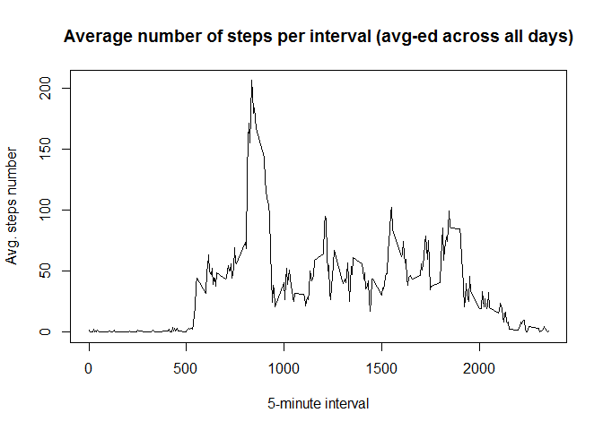

# Reproducible Research: Peer Assessment 1


```r
# Trying to load dependencies
library(data.table)
library(ggplot2)
```

## Loading and preprocessing the data


```r
# Load activities
activities.data.table <- fread("activity.csv")
# Convert dates to POSIX format
activities.data.table[, date := as.POSIXct(strptime(date, format = "%Y-%m-%d"))]
```

```
##        steps       date interval
##     1:    NA 2012-10-01        0
##     2:    NA 2012-10-01        5
##     3:    NA 2012-10-01       10
##     4:    NA 2012-10-01       15
##     5:    NA 2012-10-01       20
##    ---                          
## 17564:    NA 2012-11-30     2335
## 17565:    NA 2012-11-30     2340
## 17566:    NA 2012-11-30     2345
## 17567:    NA 2012-11-30     2350
## 17568:    NA 2012-11-30     2355
```

## What is mean total number of steps taken per day?

Histogram of the total number of steps taken each day:


```r
total.steps.per.day <- activities.data.table[, sum(steps, na.rm = TRUE), by = date]
with(list(d = total.steps.per.day), {
    d[, total.steps := V1]; d[, V1 := NULL]
    plot(total.steps ~ date, data = d, type = "h",
         main = "The total number of steps taken each day",
         xlab = "Date", ylab = "Total steps", col = "red")
})
```

 

Mean of the total number of steps taken per day:


```r
mean(total.steps.per.day[["total.steps"]])
```

```
## [1] 9354.23
```

Median of the total number of steps taken per day:


```r
median(total.steps.per.day[["total.steps"]])
```

```
## [1] 10395
```

## What is the average daily activity pattern?

The 5-minute interval (x-axis) and the average number of steps taken, averaged across all days (y-axis)


```r
avg.steps.number.per.interval <- activities.data.table[, mean(steps, na.rm = T), by = interval]
with(list(d = avg.steps.number.per.interval), {
    d[, total.steps := V1]; d[, V1 := NULL]
    plot(total.steps ~ interval, data = d, type = "l",
         main = "The 5-minute interval (x-axis) and the average number of steps taken, averaged across all days (y-axis)",
         xlab = "5-minute interval", ylab = "Total steps")
})
```

 

Average steps per interval summary


```r
summary(avg.steps.number.per.interval)
```

```
##     interval       total.steps     
##  Min.   :   0.0   Min.   :  0.000  
##  1st Qu.: 588.8   1st Qu.:  2.486  
##  Median :1177.5   Median : 34.113  
##  Mean   :1177.5   Mean   : 37.383  
##  3rd Qu.:1766.2   3rd Qu.: 52.835  
##  Max.   :2355.0   Max.   :206.170
```

Interval, on average across all the days in the dataset, contains the maximum number of steps


```r
with(list(d = avg.steps.number.per.interval), {
    max.interval.row <- d[which.max(d[["total.steps"]])]
    print(max.interval.row)
})
```

```
##    interval total.steps
## 1:      835    206.1698
```

## Imputing missing values


## Are there differences in activity patterns between weekdays and weekends?
